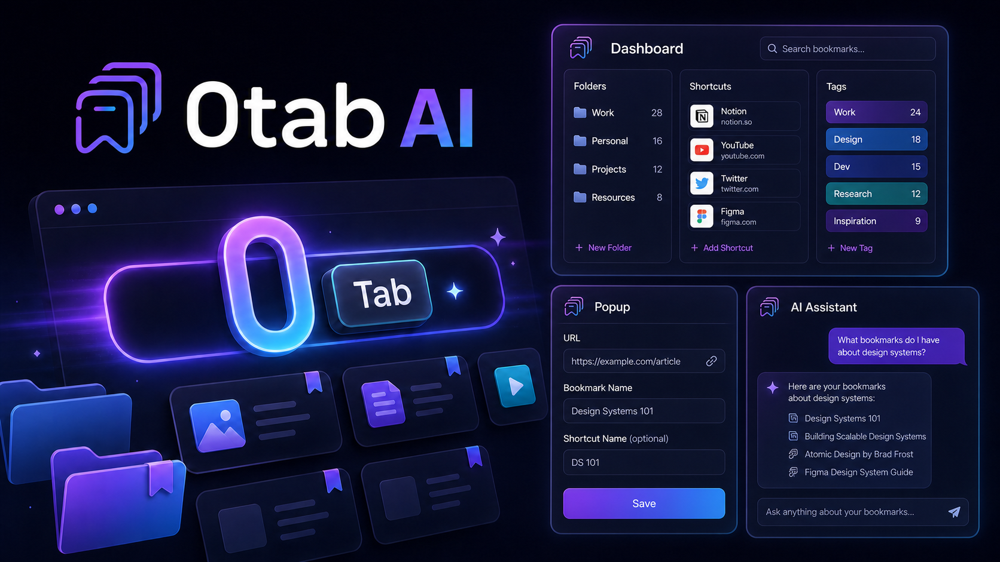

# 0tab AI

 

**[⬇ Install from the Chrome Web Store](https://chromewebstore.google.com/detail/0tab-ai/ejcaloplfaackbkpdiidjgakbogilcdf)**

Your keyboard-first bookmark command center for Chrome.

0tab AI turns the omnibox into a fast way to open saved links, organize bookmarks, manage tab groups, and ask questions about your bookmark collection. Type `0`, press **Tab**, enter a shortcut, and go.

## Why 0tab AI

- **Open bookmarks from the omnibox** with short, memorable commands.
- **Organize visually** with folders, tags, drag-and-drop, and search.
- **Manage tabs and tab groups** from one dashboard.
- **Use optional AI assistance** for bookmark-related questions and workflows.
- **Stay in control**: the project is open source and your AI provider settings are configured locally.

## Quick start

### Install the published extension

Install [0tab AI from the Chrome Web Store](https://chromewebstore.google.com/detail/tab0/ejcaloplfaackbkpdiidjgakbogilcdf?authuser=0&hl=en), or install the source locally with the steps below.

### Install from source

1. Download or clone this repository.
2. Open `chrome://extensions` in Chrome.
3. Enable **Developer mode**.
4. Click **Load unpacked** and select this repository folder.

For a guided walkthrough, read [Getting Started](docs/GETTING_STARTED.md).

## How to use it

1. Type `0` in Chrome's omnibox.
2. Press **Tab** or **Space** when Chrome shows the `0tab AI` keyword.
3. Type a saved shortcut name and press **Enter**.
4. Open the dashboard with the extension icon or `Ctrl+Shift+0` (`Command+Shift+0` on macOS).

## AI and privacy

AI is optional. If you enable an OpenAI-powered feature, configure your own API key in the extension settings; no API key is included in this repository. Bookmark data and prompts are sent to the provider only when you invoke an AI feature. Review the provider's terms and privacy policy before enabling it.

The extension requests Chrome permissions for bookmarks, tabs, tab groups, history, storage, notifications, context menus, and related navigation features. These permissions support the bookmark and tab-management workflows; inspect `manifest.json` before installing from source.

## Development

This repository contains the unpacked Manifest V3 extension. Load it through `chrome://extensions`, then use **Reload** after changing source files. The extension includes its own browser-side assets and does not require a build step for the packaged source.

## Product visuals

The repository includes a launch hero in `docs/product-hunt-hero.png`. Product Hunt gallery images should also include real screenshots or a short product demo so users can see the extension running.

For a no-build recording page with the Dashboard, Popup, AI Assistant, and omnibox flow, open [`docs/video-demo.html`](docs/video-demo.html) in a browser. Its styles are in [`docs/video-demo.css`](docs/video-demo.css).

## Contributing

Bug reports, usability feedback, and pull requests are welcome. Please include the Chrome version, reproduction steps, and relevant console output when reporting an issue.

## License

MIT © Kavil Rawat

---

_Built with [Claude Code](https://claude.com/claude-code)._
